## On-Premise Deployment

On-Premise deployment provides complete control and isolation by running all Forest Admin components (agent, backend, and UI) within your infrastructure.

**Architecture:**

```mermaid
%%{init: {'theme':'base', 'themeVariables': { 'primaryColor':'#e8f9f5','primaryTextColor':'#1a1a1a','primaryBorderColor':'#00B392','lineColor':'#00B392','secondaryColor':'#f5f5f5','tertiaryColor':'#ffffff','fontSize':'14px','nodeBorder':'#00B392','clusterBkg':'#fafafa','clusterBorder':'#00D4AA','edgeLabelBackground':'#ffffff'}}}%%
graph TD
    subgraph Your_Infrastructure["🏢 Fully hosted on your servers (Air-gapped)"]
        DB["💾 Your Database<br/>(SQL, NoSQL, APIs)"]
        Agent["⚙️ Forest Admin Agent<br/>(Node.js or Ruby)"]
        UI["🌐 Forest Admin UI<br/>(Self-hosted)"]
        Servers["🖥️ Forest Admin Backend<br/>(Self-hosted)"]

        DB -->|Direct access| Agent
        Agent --> Servers
        Servers --> UI
    end

    style DB fill:#e8f9f5,stroke:#00B392,stroke-width:3px,color:#1a1a1a
    style Agent fill:#e8f9f5,stroke:#00B392,stroke-width:3px,color:#1a1a1a
    style UI fill:#00D4AA,stroke:#00B392,stroke-width:4px,color:#1a1a1a,stroke-dasharray: 5 5
    style Servers fill:#e8f9f5,stroke:#00B392,stroke-width:3px,color:#1a1a1a
```

## Enterprise Feature

On-Premise deployment is an **enterprise feature** that requires:

- Enterprise license
- Custom configuration and setup
- Dedicated support from our team
- Full infrastructure management on your side

<Warning>
**Not available for self-service installation.** On-Premise deployment requires coordination with Forest Admin's team to ensure proper setup and licensing.
</Warning>

## What You Get

With On-Premise deployment:

- ✅ **Complete air-gapped deployment** - No external connections required
- ✅ **Full data sovereignty** - All components run in your network
- ✅ **Maximum security** - Ideal for highly regulated industries
- ✅ **Custom deployment** - Tailored to your infrastructure
- ✅ **Dedicated support** - Enterprise-level assistance

## Next Steps

To deploy Forest Admin On-Premise:

<Card
  title="Book a Demo"
  icon="calendar"
  href="https://www.forestadmin.com/demo"
>
  Schedule a call to see On-Premise in action and discuss your requirements with our enterprise team
</Card>

## Alternative Options

If On-Premise seems like overkill for your needs, consider:

<CardGroup cols={2}>
  <Card
    title="Self-Hosted"
    icon="server"
    href="/get-started/quickstart-self-hosted"
  >
    Deploy the agent in your infrastructure while using our hosted UI
  </Card>

  <Card
    title="Cloud"
    icon="cloud"
    href="/get-started/quickstart-cloud"
  >
    Let us manage everything for you
  </Card>
</CardGroup>
