With Self-Hosted deployment, you run the Forest Admin agent in your infrastructure while using our hosted UI. This gives you full control over your data and business logic.

## What you'll do

<Steps>
  <Step title="Choose your architecture">
    Standalone microservice or in-app integration
  </Step>
  <Step title="Set up the agent">
    Follow the onboarding flow to configure Forest Admin
  </Step>
  <Step title="Start your agent">
    Launch the agent and access your admin panel
  </Step>
</Steps>

## Prerequisites

Before you begin, make sure you have:

- **Node.js 18+** or **Ruby 3.0+** installed
- **A database** (PostgreSQL, MySQL, MongoDB, etc.)
- **Forest Admin account** - [Sign up here](https://app.forestadmin.com/signup) if needed

## Step 1: Choose your architecture

Forest Admin can be deployed in two ways:

### Architecture 1: Standalone microservice

A **dedicated Node.js application** that only runs Forest Admin. This is ideal for:
- Keeping Forest Admin separate from your main application
- Using Forest Admin with multiple services or databases
- Maximum isolation and independent scaling

**Architecture:**



```mermaid
%%{init: {'theme':'base', 'themeVariables': { 'primaryColor':'#e8f9f5','primaryTextColor':'#1a1a1a','primaryBorderColor':'#00B392','lineColor':'#00B392','secondaryColor':'#f5f5f5','tertiaryColor':'#ffffff','fontSize':'14px'}}}%%
graph LR
    DB[("💾 Your Database")]
    Agent["⚙️ Forest Admin Agent<br/>(Standalone Node.js app)"]
    UI["🌐 Forest Admin UI<br/>(Hosted by Forest)"]

    DB -->|Direct access| Agent
    Agent -->|API| UI

    style DB fill:#e8f9f5,stroke:#00B392,stroke-width:2px
    style Agent fill:#00D4AA,stroke:#00B392,stroke-width:3px
    style UI fill:#e8f9f5,stroke:#00B392,stroke-width:2px
```

### Architecture 2: In-app integration

**Integrate Forest Admin directly into your existing application**. This is ideal for:
- Simpler deployment alongside your existing app
- Sharing code, middleware, and infrastructure
- Single application to manage

**Architecture:**



```mermaid
%%{init: {'theme':'base', 'themeVariables': { 'primaryColor':'#e8f9f5','primaryTextColor':'#1a1a1a','primaryBorderColor':'#00B392','lineColor':'#00B392','secondaryColor':'#f5f5f5','tertiaryColor':'#ffffff','fontSize':'14px'}}}%%
graph LR
    DB[("💾 Your Database")]
    App["🔧 Your Application<br/>+ Forest Admin Agent"]
    UI["🌐 Forest Admin UI<br/>(Hosted by Forest)"]

    DB -->|Direct access| App
    App -->|API| UI

    style DB fill:#e8f9f5,stroke:#00B392,stroke-width:2px
    style App fill:#00D4AA,stroke:#00B392,stroke-width:3px
    style UI fill:#e8f9f5,stroke:#00B392,stroke-width:2px
```

Choose the architecture that best fits your needs and continue with the appropriate guide below.

## Step 2: Set up the agent

<Tabs>
  <Tab title="Standalone">
    ### Follow the onboarding flow

    1. Go to [app.forestadmin.com](https://app.forestadmin.com) and create a new project
    2. Choose **"Self-Hosted"** deployment
    3. Select **"Standalone application"** option
    4. Follow the onboarding instructions. They will guide you to:
       - Install Forest Admin CLI: `npm install -g forest`
       - Login to Forest Admin: `forest login`
       - Generate the standalone application: `forest create:project`

    When this is done, you are prompted to start your newly created agent:

    ```bash
    npm start
    ```

    🎉 **Congratulations!** Your agent should start on port `3310` by default and display:
    ```
    [Forest] 🌳  Your agent is now running at http://localhost:3310
    ```

    <Info>
    This command automatically generates a standalone application, with all the files necessary to make Forest Admin work, including a first `.env` with the environment variables such as `FOREST_ENV_SECRET` and `FOREST_AUTH_SECRET`.
    </Info>

    <Warning>
    Never commit your `.env` file to version control. Add it to `.gitignore`.
    </Warning>
  </Tab>

  <Tab title="In-app (Node.js)">
    Forest Admin integrates with popular Node.js frameworks: **Express**, **Fastify**, **Koa**, **NestJS**, and more.

    ### Follow the onboarding flow

    1. Go to [app.forestadmin.com](https://app.forestadmin.com) and create a new project
    2. Select **"In-app integration"** option
    3. Choose your framework (**Express**, **Fastify**, **Koa**, **NestJS**)
    4. Follow the onboarding instructions. They will provide you with:
       - Installation command for Forest Admin packages
       - Ready-to-use code snippet with your `FOREST_ENV_SECRET` and `FOREST_AUTH_SECRET` already configured
       - Instructions on where to add the code in your application

    5. Add the provided code to your application and start your app:

    ```bash
    npm start
    # or
    npm run dev
    ```

    🎉 **Congratulations!** The Forest Admin agent will start on port `3310` alongside your application.

    <Warning>
    Never commit your `.env` file to version control. Add it to `.gitignore`.
    </Warning>
  </Tab>

  <Tab title="In-app (Ruby)">
    Forest Admin integrates seamlessly with **Ruby on Rails** applications.

    ### Follow the onboarding flow

    1. Go to [app.forestadmin.com](https://app.forestadmin.com) and create a new project
    2. Select **"In-app integration"** option
    3. Choose **Ruby on Rails**
    4. Follow the onboarding instructions. They will provide you with:
       - Installation command for the Forest Admin gem
       - Ready-to-use configuration with your `FOREST_ENV_SECRET` and `FOREST_AUTH_SECRET` already configured
       - Instructions on where to add the configuration in your Rails application

    5. Add the provided configuration to your application and start your app:

    ```bash
    rails server
    ```

    🎉 **Congratulations!** Your application (including Forest Admin) will start on port `3000` by default.

    <Warning>
    Never commit your `.env` file to version control. Add it to `.gitignore`.
    </Warning>
  </Tab>
</Tabs>

## Step 3: Access your admin panel

Once your agent is running, **Forest Admin automatically opens your admin panel in the browser**.

🎉 **Congratulations!** Your admin panel is ready.

Forest Admin automatically:
- ✅ Discovered your database schema
- ✅ Analyzed relationships between tables
- ✅ Created collections for each table
- ✅ Set up CRUD operations
- ✅ Configured search and filters
- ✅ Generated a default layout

After an optional review, you can immediately access the Forest Admin UI to manage your data.

## What's next?

<CardGroup cols={3}>
  <Card title="Follow a Learning Path" icon="graduation-cap" href="/guides/learning-paths">
    Structured learning journey tailored to your role
  </Card>
  <Card title="Customize your UI" icon="paintbrush" href="/product/build/layout-editor">
    Use the layout editor to customize your admin panel
  </Card>
  <Card title="Add business logic" icon="wand-magic-sparkles" href="/product/process/actions/overview">
    Create Smart Actions for custom workflows
  </Card>
</CardGroup>

## Troubleshooting

<AccordionGroup>
  <Accordion title="Agent not starting" icon="circle-xmark">
    **Check that your agent is properly started:**

    1. **Is your agent running?** Check the terminal for startup messages
    2. **Check for errors** in the console output
    3. **Verify environment variables** - ensure `.env` file is loaded
    4. **Check port conflicts** - ensure the port is available:
       - Node.js standalone/in-app: port `3310`
       - Rails: port `3000` (or your configured port)

    **Quick healthcheck test:**

    <Tabs>
      <Tab title="Node.js">
        ```bash
        curl http://localhost:3310/forest
        ```
        Should return: `{"meta":{"name":"@forestadmin/agent",...}}`
      </Tab>
      <Tab title="Ruby">
        ```bash
        curl http://localhost:3000/forest
        ```
        Should return Forest Admin metadata
      </Tab>
    </Tabs>
  </Accordion>

  <Accordion title="Cannot connect from Forest Admin UI" icon="plug">
    **Connection troubleshooting checklist:**

    1. ✅ **Is your agent running?** Check the terminal for the "agent is now running" message
    2. ✅ **Can you reach the healthcheck?**
       - Node.js: Visit `http://localhost:3310/forest` in your browser
       - Ruby: Visit `http://localhost:3000/forest` in your browser
    3. ✅ **Do you see network calls?** Open browser DevTools (F12) → Network tab, look for calls to your agent URL
    4. ✅ **Browser extensions blocking requests?** Some ad blockers or privacy extensions block network calls
    5. ✅ **Try incognito/private mode** - Brave and some browsers block local network calls by default

    **For production deployments:**
    - Ensure your agent is publicly accessible (or via VPN)
    - Check firewall rules allow inbound connections
    - Verify SSL certificates if using HTTPS
    - Check CORS configuration if applicable
  </Accordion>

  <Accordion title="No tables showing up" icon="table">
    **Solution:** Make sure your database connection is working.

    1. Check your `DATABASE_URL` environment variable is correct
    2. Verify database credentials and permissions
    3. Check the agent logs for database connection errors
    4. Ensure the database user has read permissions on tables

    **Test your database connection:**
    <Tabs>
      <Tab title="Node.js">
        ```bash
        # Quick connection test
        node -e "const { Client } = require('pg'); const client = new Client(process.env.DATABASE_URL); client.connect().then(() => console.log('✅ Connected!')).catch(err => console.error('❌ Error:', err.message))"
        ```
      </Tab>
      <Tab title="Ruby">
        ```bash
        rails dbconsole
        # Should connect to your database
        ```
      </Tab>
    </Tabs>
  </Accordion>

  <Accordion title="Deploy to production" icon="cloud">
    **Deploy your agent to production:**

    For detailed deployment guides, see:
    - [Production Deployment Guide](/guides/deployment/production)
    - [Deploy to AWS](/guides/deployment/platforms/aws)
    - [Deploy to Heroku](/guides/deployment/platforms/heroku)

    **Quick checklist:**
    1. Deploy your agent to your hosting platform
    2. Set environment variables (`FOREST_ENV_SECRET`, `FOREST_AUTH_SECRET`, `DATABASE_URL`)
    3. Set `NODE_ENV=production` (Node.js) or `RAILS_ENV=production` (Ruby)
    4. Ensure your production database is accessible from your agent
    5. Configure your agent URL in Forest Admin UI

    **Learn more:** [Self-Hosted Architecture](/product/integration/architectures/self-hosted)
  </Accordion>
</AccordionGroup>

## Need help?

- **Documentation**: [Self-Hosted Architecture](/product/integration/architectures/self-hosted)
- **Setup Guides**: [Node.js Setup](/product/integration/setup/nodejs) | [Ruby Setup](/product/integration/setup/ruby)
- **Community**: [community.forestadmin.com](https://community.forestadmin.com)
- **Support**: [support@forestadmin.com](mailto:support@forestadmin.com)
