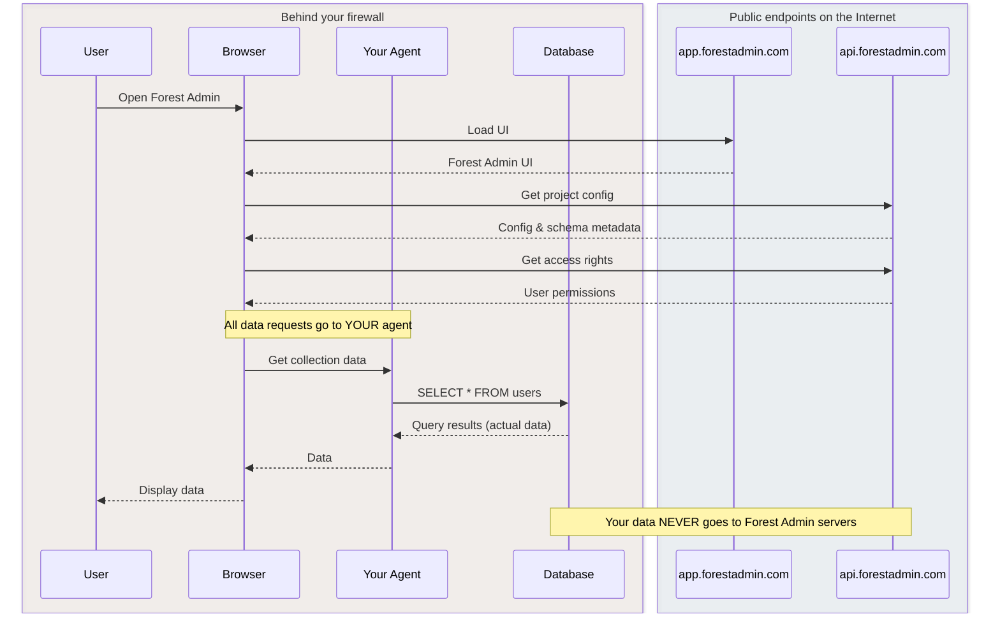

The self-hosted architecture gives you full control over your data and code by hosting the Forest Admin agent in your own infrastructure. This is the **most popular deployment option** for production applications.

## Architecture Overview

### How it works

1. **Your users** access the Forest Admin UI hosted at `app.forestadmin.com`
2. **Forest Admin UI** makes API calls to your agent
3. **Your agent** runs in your infrastructure (AWS, GCP, Heroku, etc.)
4. **Your agent** queries your database directly
5. **All data** stays within your infrastructure

<Info>
**Key benefit**: This architecture follows our privacy by design motto. Your data never leaves your infrastructure.
</Info>

## Components

| Component | Hosted by | Location | Responsibilities |
|-----------|-----------|----------|------------------|
| **Your Agent** | You | Your infrastructure | • Runs in Node.js or Ruby • Direct access to your database • Executes business logic (Smart Actions, Fields, Hooks) • Handles authentication and authorization • Exposes REST API for Forest Admin UI |
| **Forest Admin UI** | Forest Admin | `app.forestadmin.com` | • Admin interface for your users • Communicates with your agent via HTTPS • Receives only schema metadata (no data) • Managed and updated by Forest Admin |
| **Your Database** | You | Your infrastructure | • PostgreSQL, MySQL, MongoDB, etc. • Only accessible to your agent • No direct connection from Forest Admin • Your data never leaves your infrastructure |

## Agent deployment

You can deploy the Forest Admin agent in two ways, depending on your application architecture:

### In-app deployment

With in-app deployment, the Forest Admin agent becomes part of your existing application. It runs in the same Node.js or Ruby process, sharing the same database connection pool and resources. When you deploy your application, the agent deploys with it as a single unit.

This approach is particularly valuable when you want to leverage your existing ORM models. Whether you're using Sequelize, Mongoose, or ActiveRecord, Forest Admin can read directly from your model definitions—no need to redefine your schema. You can also reuse your existing business logic, sharing code, services, and utilities between your application and Forest Admin without duplication.

### Standalone deployment

Standalone deployment runs the Forest Admin agent as a completely separate service. It operates in its own process or container with dedicated resources and its own database connection pool. Your application and the admin panel are deployed and scaled independently.

This architecture provides a cleaner separation of concerns. Your application code stays focused on your business logic, while Forest Admin responsibilities are isolated in their own service. The two services communicate through well-defined boundaries, making your overall system architecture simpler to understand and maintain. This is particularly beneficial as your team grows—developers working on the application don't need to think about admin panel concerns, and vice versa.

<Info>
**Note**: Standalone deployment is currently available for Node.js only. If you need standalone deployment with Ruby, please [contact our sales team](https://www.forestadmin.com/contact).
</Info>

**Architecture comparison**

| Aspect | In-app | Standalone |
|--------|--------|------------|
| **Deployment** | Single deployment | Separate deployment |
| **Process** | Shared with your app | Dedicated process |
| **Port** | Same port as your app | Own port (e.g., 3310) |
| **Database connections** | Shared pool | Dedicated pool |
| **Scaling** | Scales with your app | Scales independently |
| **Resources** | Shared CPU/memory | Dedicated CPU/memory |
| **Isolation** | Low isolation | High isolation |

<Info>
**Recommendation**: We recommend **standalone deployment** for cleaner architecture and better separation of concerns. Use **in-app** if you need to reuse your ORM models or existing business logic.
</Info>

## Privacy by design

The self-hosted architecture is built with privacy as a core principle. Here's how data flows when a user accesses Forest Admin:

**The key principle:** Forest Admin's servers (`app.forestadmin.com`, `api.forestadmin.com`) only send configuration and UI code to your browser. All data requests go directly from your browser to your agent behind your firewall, and your data never leaves your infrastructure.

| What stays behind your firewall | What Forest Admin receives |
|----------------------------------|----------------------------|
| ✅ **All your data** (customers, orders, PII) | ⚙️ **Schema metadata** (table/column names, types) |
| ✅ **Database queries** (`SELECT * FROM users`) | ⚙️ **Access rights configuration** |
| ✅ **Query results** (actual records) | ❌ No data |
| ✅ **Business logic** (Smart Actions, Fields) | ❌ No query results |

## Need help?

If you encounter issues during setup, check out our [troubleshooting guide](/guides/troubleshooting-onboarding-authentication) for common onboarding and authentication problems.
